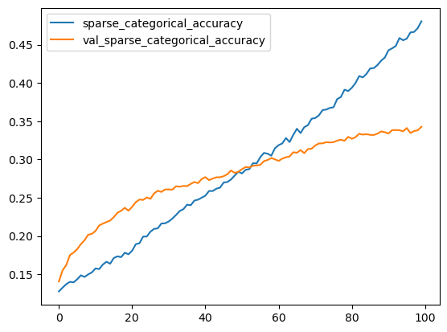
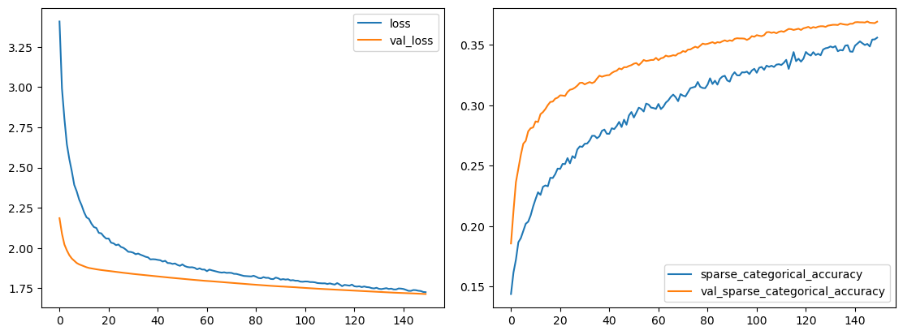
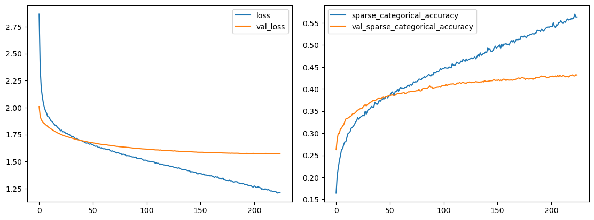
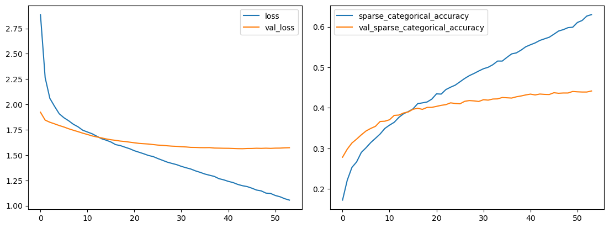
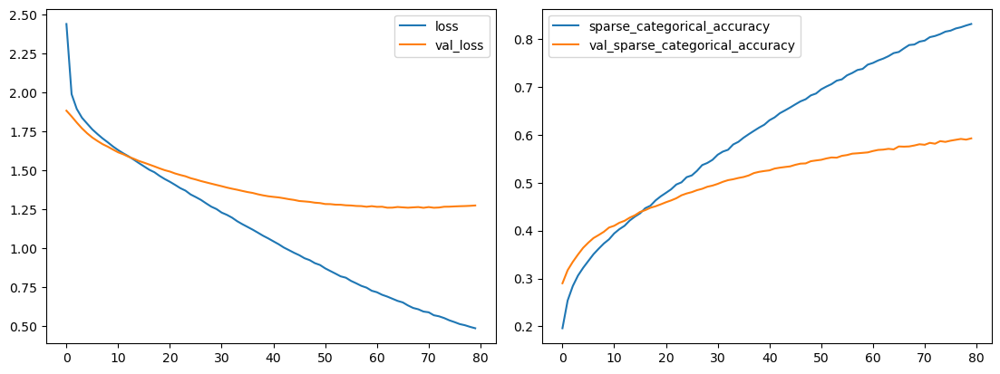
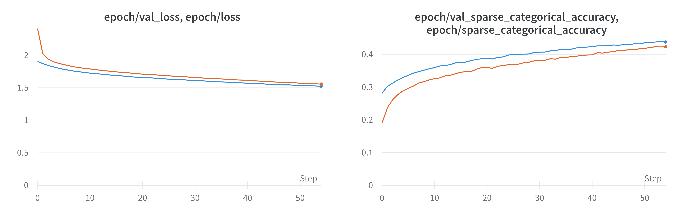
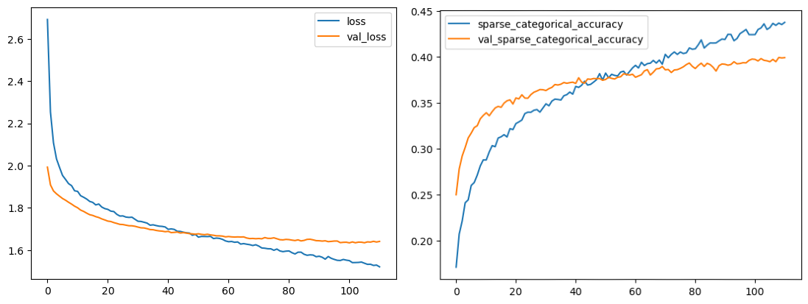

# Project 2 - Convolutional Neural Network for Affect Recognition

Course: Neural Networks @ FIIT STU\
Authors: Viktor Modroczký & Michaela Hanková

## Dataset

We used the [Facial Expressions Training Data](https://www.kaggle.com/datasets/noamsegal/affectnet-training-data) from Kaggle. The dataset contains 29,042 images of 8 different classes of emotions which are not balanced - anger, contempt, disgust, fear, happy, neutral, sad, and surprise. The images are 96x96 pixels in size and have 3 channels (RGB).

## Preprocessing

### Datasplit Script

We created a Python script that splits the dataset into training and test sets by random sampling from the original dataset and optionally balances the dataset by augmenting classes smaller in size relative to the largest class. If balancing is enabled, it can also optionally perform global augmentation. Meaning that the number of images in each class can be increased by a global multiplier. The script also creates a CSV file with label to filename mappings for the training and test sets.

The augmentation pipleine used it the script is created using the [Albumentations](https://albumentations.ai/) library. The pipeline is a composition of transformations that are applied to the images and is defined like this:

```py
A.Compose(
  [
    A.HorizontalFlip(p=0.5),
    A.RandomBrightnessContrast(
      always_apply=True, contrast_limit=0.2, brightness_limit=0.2
    ),
    A.OneOf(
      [
        A.MotionBlur(always_apply=True),
        A.GaussNoise(always_apply=True),
        A.GaussianBlur(always_apply=True),
      ],
      p=0.5,
    ),
    A.PixelDropout(p=0.25),
    A.Rotate(always_apply=True, limit=20, border_mode=cv2.BORDER_REPLICATE),
  ]
)
```

Horizontal flip is applied with a probability of 50%. Random brightness and contrast are always applied with a contrast limit of &pm;20% and a brightness limit of &pm;20%. One of motion blur, Gaussian noise, or Gaussian blur is applied with a probability of 50%. Pixel dropout is applied with a probability of 25%. Rotation by a random angle is always applied with a limit of &pm;20 degrees and border mode set to replicate colors at the borders of the image being rotated to avoid black borders.

If enabled, augmentations are applied both to the training and test sets.

Before running the script, make sure that the dataset is downloaded and extracted to a folder with the following structure:

```text
your_dataset_folder
└── train
    ├── anger
    ├── contempt
    ├── disgust
    ├── fear
    ├── happy
    ├── neutral
    ├── sad
    └── surprise
```

The script will create a `test` subdirectory in the directory and will move part of the images from the `train` subdirectory to the `test` subdirectory. This means that the default behavior of the script is to overwrite the input directory. The script will also create a `train.csv` and `test.csv` files in the directory. The `train.csv` file will contain the label to filename mappings for the training set and the `test.csv` file will contain the label to filename mappings for the test set.

If the script is ran with a specified output path, the script will first copy the images from the `train` subdirectory in the input directory to the `train` subdirectory in the output directory and will create the `test` subdirectory in the output directory. The `train.csv` and `test.csv` files will be created in the output directory. If the output directory does not exist, it will be created. If the output directory exists, it can only contain an empty `train` subdirectory or can be empty completely.

Besides the dataset, the script requires installation of required Python packages listed in the [`requirements.txt`](./requirements.txt) file. The packages can be installed using the following command:

`pip install -r requirements.txt`

The script is universal and can be used for any dataset that has the same structure (dataset with a train subdirectory with images in subdirectories named after the labels).

### Running the Datasplit Script

The script is available in the [`src/datasplit.py`](./src/datasplit.py) file. It can be run following this pattern:

`python datasplit.py [-h] [--balance-train] [--balance-test] [--output-path OUTPUT_PATH] [--train-split TRAIN_SPLIT] [--seed SEED] [--label-col LABEL_COL] [--filename-col FILENAME_COL] [--global-multiplier GLOBAL_MULTIPLIER] [--pipeline-yaml PIPELINE_YAML] path`

Positional argument:

- `path` - Path to a directory that includes a train directory with the images in subdirectories named after the labels, e.g. if `path` is `data`, then the images should be in `data/train/class1`, `data/train/class2`, etc.

Options:

- `-h`, `--help` - show help message and exit
- `--balance-train` - Balance classes in training set and optionally perform global augmentation for the training set if `GLOBAL_MULTIPLIER` is greater than 1.0 (default: `False`)
- `--balance-test` - Balance classes in created test set and optionally perform global augmentation for the test set if `GLOBAL_MULTIPLIER` is greater than 1.0 (default: `False`)
- `--output OUTPUT` - Path to an empty output directory (default: `None` - overwrite input directory)
- `--train-split TRAIN_SPLIT` - Train split ratio (default: `0.8`)
- `--seed SEED` - Random seed (default: `None`)
- `--label-col LABEL_COL` - Label column name (default: `'label'`)
- `--filename-col FILENAME_COL` - Filename column name (default: `'filename'`)
- `--global-multiplier GLOBAL_MULTIPLIER` - Global multiplier for the number of images in each class (default: `1.0`). This option can be used to increase the number of images in each class but is ignored if `--balance` is not used.
- `--pipeline-yaml` - Path to a custom Albumentations Compose pipeline serialized to YAML (default: `None` - use pipeline included in this script)

If you would like to use the `--pipeline-yaml` option, the following is a brief description of a custom pipeline and its serialization:

The pipeline has to be an instance of [`albumentations.core.composition.Compose`](https://albumentations.ai/docs/api_reference/core/composition/#albumentations.core.composition.Compose) and it must be serialized to a YAML file using [`albumentations.core.serialization.save`](https://albumentations.ai/docs/api_reference/core/serialization/#albumentations.core.serialization.save). The script will then internally be able to deserialize the pipeline using [`albumentations.core.serialization.load`](https://albumentations.ai/docs/api_reference/core/serialization/#albumentations.core.serialization.load).

Example of serializing a custom pipeline is included in the [`src`](./src) folder and is named [`custom_pipeline_example.py`](./src/custom_pipeline_example.py). Example of a serialized pipeline is included in the root folder and is named [`custom_pipeline_example.yml`](./custom_pipeline_example.yml).

### Relabeling the Dataset

The original dataset also has a `labels.csv` file which includes improved labels by machine learning. We decided to create a script that relabels the dataset using the improved labels. The script is available in the [`src/relabel.py`](./src/relabel.py) file.

### Running the Relabeling Script

It can be run following this pattern:

`python relabel.py [-h] [--output-path OUTPUT_PATH] [--label-csv] path`

Positional argument:

- `path` - Path to a directory that includes a CSV file with improved labels and a train directory with the images in subdirectories named after the labels, e.g. if `path` is `data`, then the images should be in `data/train/class1`, `data/train/class2`, etc., and the CSV file with improved labels should be in a CSV file in `data`

Options:

- `-h`, `--help` - Show help message and exit

- `--output-path OUTPUT_PATH` - Path to an output directory (required)

- `--label-csv LABEL_CSV` - Name of the CSV file with improved labels including file extension (default: `labels.csv` - use labels from `path/labels.csv`)

The script was written only for this specific dataset having a CSV file that contains an index column, a `pth` column, and a `label` column. The `relFCs` column is ignored.

### How we ran the scripts

We ran the `relabel.py` script on the original dataset first. Then we ran the `datasplit.py` script on the original dataset and relabeled dataset with and without balancing the classes and augmenting the dataset.

**The following commands were used to create the datasets wihout balancing the classes:**

`python src/datasplit.py --seed 27 --output-path data_split data`

The resulting dataset is not balanced but only split into training and test sets and contains 29,042 images in total. The training set contains 23,234 images and the test set contains 5,808 images. The images use their original labels.

The dataset is available on Kaggle: [Facial Affect Dataset Unbalanced](https://www.kaggle.com/datasets/viktormodroczky/facial-affect-dataset-unbalanced)

`python src/datasplit.py --seed 27 --output-path data_relabeled_split data_relabeled`

The resulting dataset is not balanced but only split into training and test sets and contains 28,664 images in total. The training set contains 22,930 images and the test set contains 5,734 images. The images use the improved labels. The dataset is smaller due to the fact that the `relabel.py` script overwrites images with the same filename (issue in the script was discovered after the dataset was created).

The dataset is available on Kaggle: [Facial Affect Dataset Relabeled Unbalanced](https://www.kaggle.com/datasets/viktormodroczky/facial-affect-dataset-relabeled-unbalanced)

**The following commands were used to create the datasets with balancing the classes:**

`python src/datasplit.py --balance-train --balance-test --seed 27 --output-path data_relabeled_balanced_1x data_relabeled`

The resulting dataset is split into training and test sets and is balanced. It contains 36,514 images in total. The training set contains 29,217 images (~3,652 in each class) and the test set contains 7,297 images (~912 in each class). The images use the improved labels. Again, the dataset is smaller due to the fact that the `relabel.py` script overwrites images with the same filename.

`python src/datasplit.py --balance-train --balance-test --seed 27 --global-multiplier 3.0 --output-path data_relabeled_balanced_3x data_relabeled`

The resulting dataset is split into training and test sets and is balanced. It contains 109,536 images in total. The training set contains 87,648 images (10,956 in each class) and the test set contains 21,888 images (~2,736 in each class). The images use the improved labels. The same issue with less images applies as in the previous case.

Both datasets are available on Kaggle as `data_relabeled_balanced_1x` and `data_relabeled_balanced_3x`: [Facial Affect Dataset Relabeled](https://www.kaggle.com/datasets/viktormodroczky/facial-affect-data-relabeled)

## Model

We decided to implement each ResNet model in Tensorflow and choose the best performing model as our final model. The models are based on the [Deep Residual Learning for Image Recognition](https://arxiv.org/abs/1512.03385) paper by Kaiming He, Xiangyu Zhang, Shaoqing Ren, and Jian Sun (2015). The models are implemented in the [`src/resnets.py`](./src/resnets.py) file.

We used the following ResNet models:

- ResNet-18
- ResNet-34
- ResNet-50
- ResNet-101
- ResNet-152

Each model is implemented as a function that follows this signature:

```py
def ResNetN(
    input_shape: Tuple[int, int, int],
    output_units=1000,
    include_top=True,
    after_input: Union[Sequential, Layer, None] = None,
    normalize=False,
    kernel_regularizer: Union[Regularizer, None] = None,
    kernel_initializer="he_uniform",
    flatten=False,
    dropout_rate=0.0,
) -> Model
```

where N in the function name is the number of layers in the model that should be replaced with 18, 34, 50, 101, or 152. The function takes the following parameters:

- `input_shape` - Shape of the input images
- `output_units` - Number of output units used in the last layer if `include_top` is `True` (default: `1000`)
- `include_top` - Whether to include the network top after global average pooling or the flatten layer (default: `True`)
- `after_input` - Custom layers to add after the input like preprocessing layers as a Keras model of class `tf.keras.Sequential` or as a single layer of class `tf.keras.layers.Layer` (default: `None` - no custom layers)
- `normalize` - Whether to normalize the input images to the range [0, 1] (default: `False`)
- `kernel_regularizer` - Kernel regularizer of class `tf.keras.regularizers.Regularizer` (default: `None`)
- `kernel_initializer` - Kernel initializer (default: `he_uniform`)
- `flatten` - Whether to use a flatten layer instead of a global average pooling layer after the last block (default: `False` - use global average pooling)
- `dropout_rate` - Dropout rate used after global average pooling or flattening (default: `0.0`)

Models use the [Functional API](https://www.tensorflow.org/guide/keras/functional) of Keras under the hood which defines the model's structure as a directed acyclic graph of layers. The function returns a `tf.keras.Model` instance that needs to be compiled and trained.

The implementation was tested by successfully creating each model and printing its summary to text files. We used a helper function to print model summaries to text files:

```py
def write_summary(model: Model, file_path: str) -> None:
    with open(file_path, "w") as f:
        model.summary(print_fn=lambda x: f.write(x + "\n"))
```

The text files are included in the root folder and are named [`resnet18.txt`](./resnet18.txt), [`resnet34.txt`](./resnet34.txt), [`resnet50.txt`](./resnet50.txt), [`resnet101.txt`](./resnet101.txt), and [`resnet152.txt`](./resnet152.txt).

## Training and Testing Environment

We used Kaggle notebooks for model training and testing on a GPU - a Tesla P100. Training complex model like ResNets on a CPU would take a very long time so we didn't prepare a Docker image for CPU training and testing.

## Training

As a starting point we were inspired by Kaiming He et al. and their paper. They used SGD with a learning rate of 0.1 and a momentum of 0.9. They also used weight decay of 0.0001 and a batch size of 256. We decided to use all but the batch size, which we set to 32. We note that instead of weight decay we used a kernel regularizer with an L2 norm of 0.0001, which according to Ilya Loshchilov and Frank Hutter ([Fixing Weight Decay Regularization in Adam](https://arxiv.org/pdf/1711.05101v2.pdf), 2018) is equivalent to weight decay when paired with SGD.

We also used a similar learning rate schedule as in the paper. Our scheduler was set to monitor validation loss and reduce the learning rate by a factor of 0.1 when the validation loss did not improve for 5 epochs. We also used early stopping with a patience of 10 epochs and best weights restoration.

These hyperparameters were used for all ResNet models we implemented. As training data we used the unbalanced datasets first to get a baseline on how well the models perform. All models were trained on the imbalanced dataset with original labels and the imbalanced relabeled dataset so we could compare the effect of relabeling the dataset on the model performance.

All images were normalized to the range [0, 1] using a `Rescaling` layer with a scale of 1.0/255. The training data was split into training and validation sets using a 80/20 split.

Training has been logged using [Weights & Biases](https://wandb.ai/). The training notebooks are available in the [`src`](./src) folder. The notebook [`resnet-selection-original-labels.ipynb`](./src/resnet-selection-original-labels.ipynb) contains the training of the models on the unbalanced dataset with original labels. The notebook [`resnet-selection-improved-labels.ipynb`](./src/resnet-selection-improved-labels.ipynb) contains the training of the models on the unbalanced dataset with improved labels. Please note that both of these notebooks were written prior breaking changes in our ResNet implementation and the notebooks are not up to date with the current implementation.

The report from training with the unbalanced dataset with original labels and without any augmentation is available on Weights & Biases [here](https://api.wandb.ai/links/nsiete23/5wrwkqey).

The report from training with the unbalanced dataset with improved labels and without any augmentation is available on Weights & Biases [here](https://api.wandb.ai/links/nsiete23/cmp2nhvu).

In both cases the ResNet-18 and ResNet-34 seem to perform the best even though every model struggled to learn anything. Only the training accuracy kept increasing while the validation accuracy reached a plateau over time. The smaller models reached this validation accuracy plateau earlier than the larger models. After reaching the plateau on ResNet-18 and ResNet-34 the models started to visibly overfit because of earlier plateauing. The larger models started overfitting too but it was not as visible on the Wandb validation loss graphs due to large validation loss at earlier epochs. After zooming in on the validation loss graphs we could see increasing validation loss on the larger models as well.

### ResNet-18 Training

After seeing the baseline results, we decided to continue using the smaller models not only because they performed relatively well, but also because they are the fastest to train considering our time constraints.

The next step was to try to improve the model performance by using the smaller balanced dataset with improved labels. The balancing was done by oversampling the minority classes as described in the [Preprocessing](#preprocessing) section.

We switched from SGD with momentum to Adam. L2 regularization was omitted because according to Ilya Loshchilov and Frank Hutter it is not effective when using the Adam optimizer. Since Adam is an optimizer with adaptive learning rate, we also omitted the learning rate scheduler. We continued using early stopping with a patience of 10 epochs and best weights restoration.

At first we chose 64 as the batch size and 0.0001 as the learning rate for the Adam optimizer with $\beta_1$ and $\beta_2$ being set to 0.9 and 0.999 respectively. The training went very poorly so we ended the training on epoch 7 with a training loss of 0.0975 and a validation loss of 3.4805 which was higher than the starting validation loss of 1.7675.

We decided to try a much smaller learning rate of 0.000001 keeping the batch size at 64. The model didn't overfit before we stopped the training after 50 epochs but the validation loss was still high (1.7125) and kept significantly diverging from the training loss (1.0769).

Next we tried a learning rate of 0.0000001 and kept the batch size. This learning rate is too small for the model to continue converging at an acceptable rate. After 100 epochs the training loss was 1.7903 and the validation loss was 1.9027 and the training accuracy was 0.3466 and the validation accuracy was 0.2814.

We also tried a learning rate of 0.1 but the model heavily overfit after 14 epochs. Another try with a learning rate of 0.0001 and a batch size of 4 was also unsuccessful. After 4 epochs the training loss was 0.7182 and the validation loss was 1.8660.

A batch size of 512 and a learning rate of 0.001 yielded even worse results and the model started overfitting after 5 epochs. The next attempt was a batch size of 32 and a learning rate of 0.00001 with images converted to grayscale with no success - we experienced another case of overfitting after 5 epochs.

We next returned to RGB images, batch size of 64, and learning rate of 0.000001 but this time we didn't normalize the images. The progress was similar to the attempt with normalized images and same batch size and learning rate - so we stopped the training after 24 epochs seeing its trend.

After no success with the Adam optimizer we decided to try SGD again, this time without momentum and without any L2 kernel regularization. We set the batch size to 64 and learning rate to 0.001. We saw the same pattern - training loss decreasing rapidly while validation loss lagged behind.

Another attempt was using SGD with Nesterov momentum at 0.9, learning rate of 0.001, and batch size of 64. This time we used L2 kernel regularization at 0.001. The training resulted in the same pattern as before.

#### ResNet-18 with a changed top

We also tried to change the top of the ResNet-18 model by replacing the last `Dense` layer with a top similar to VGG16 as stated in [Very Deep Convolutional Networks for Large-Scale Image Recognition](https://arxiv.org/pdf/1409.1556.pdf) by Karen Simonyan and Andrew Zisserman (2015). Instead of a single `Dense` layer with 8 units we used 3 `Dense` layers with 4096, 4096, and 8 units respectively. We also added a `Dropout` layer with a rate of 0.5 after the first 2 `Dense` layers. Instead of a `GlobalAveragePooling2D` layer we used a `Flatten` layer before the first `Dense` layer. After the `Flatten` layer we used a `Dropout` layer with a rate of 0.2. The model was trained using the Adam optimizer with a learning rate of 0.00001, a batch size of 64, $\beta_1$ of 0.9, and $\beta_2$ of 0.999. We trained the model on the same data - balanced dataset with improved labels.

The model was initialized like this:

```py
import resnets as rn # our custom ResNet implementations

model = rn.ResNet18(
    (image_size, image_size, channels),
    normalize=config["normalize"],
    include_top=False,
    flatten=True,
    dropout_rate=0.2
)

top = Dense(4096, activation="relu")(model.output)
top = Dropout(0.5)(top)
top = Dense(4096, activation="relu")(top)
top = Dropout(0.5)(top)
top = Dense(len(classes), activation="softmax")(top)

model = Model(inputs=model.input, outputs=top)
```

The model started overfitting after 15 epochs. We ended the training after the 21st epoch on 0.6711 training loss and 1.9891 validation loss.

#### ResNet-34 with a changed top

After the unsuccessful attempt with ResNet-18 we decided to try the same approach with ResNet-34 and the same balanced data with improved labels. We used the same VGG16-like top as with ResNet-18 and the same optimizer and hyperparameters - learning rate of 0.00001 and a batch size of 64. The model started heavily overfitting after 12 epochs so we see no improvement over previous attempts. The training loss started at 2.057 and ended at 4.132 before early stopping at epoch 22.

Another attempt was to use a different learning rate of 0.000001. Although the model didn't overfit, around epoch 50 the training loss started to diverge from the validation loss so the validation loss on epoch 100 was 1.7835 and the training loss was 1.3926. In case of accuracy the training accuracy was 0.4806 and the validation accuracy was 0.3428. We found the accuracy progress particularly interesting because training accuracy almost had a linear increase which can be seen in the graph below.



The notebook for the last experiment in this series of attempts with ResNet-18 and ResNet-34 can be found in the [`src`](./src/) directory as [`resnet-34-affect-better-labels-balanced.ipynb`](./src/resnet-34-affect-better-labels-balanced.ipynb).

#### ResNet-50 from Tensorflow pretrained on ImageNet

We decided to try using a ResNet-50 model pretrained on ImageNet that is available in the Tensorflow library. We used a similar top as the VGG16-like top we used with ResNet-18 and ResNet-34 but with less neurons, 2048 and 512 respectively. We also set a different dropout rate of 0.2 before the last `Dense` layer. Keras applications require the input to be preprocessed to match the ImageNet dataset. To do that Tensorflow provides a `preprocess_input` function that can be used to preprocess the input. The model was initialized like this:

```py
from tensorflow.keras.applications.resnet50 import ResNet50, preprocess_input

inputs = Input(shape=(image_size, image_size, channels))
x = preprocess_input(inputs)

model = ResNet50(
    include_top=False,
    weights='imagenet',
    input_shape=(image_size, image_size, channels),
    pooling="avg"
)
model.trainable = config["trainable"]

outputs = model(x)

top = Dense(2048, activation='relu')(outputs)
top = Dropout(0.5)(top)
top = Dense(512, activation='relu')(top)
top = Dropout(0.2)(top)
top = Dense(len(classes), activation='softmax')(top)

model = Model(inputs=inputs, outputs=top)
```

We used SGD with a momentum of 0.9, learning rate of 0.00001, and a batch size of 64. The `config["trainable"]` variable was set to `False` so the ImageNet weights were frozen. At first we set the number of epochs to 15 to see the direction of training - it was smooth so far and both training and validation loss were decreasing.

We decided to increase the number of epochs to 150 with early stopping after 10 epochs without improvement and best weights restoration. The training seemed very promising but convergence was very slow and this number of epochs was not enough to reach a good result (see graphs below).



We had 2 options of continuing the training - either increase the learning rate or increase the the number of epochs. Based on previous observations, increasing the learning rate too much could lead to the training and validation loss diverging early with suboptimal results. We decided to increase the learning rate to 0.00005 and the number of epochs to 500. The training was stopped by the early stopping callback on epoch 250. There was no overfitting and the training and validation loss were decreasing until the end. No good results were achieved though - around epoch 50 the training and validation loss and accuracy started diverging and less than 50% validation accuracy was achieved.



In the next attempt we used AdamW with a learning rate of 0.00001, weight decay of 0.004, $\beta_1$ of 0.9, and $\beta_2$ of 0.999. The batch size stayed at 64. We didn't freeze ImageNet weights and we used the same top as before. Early stopping was used too with a patience of 10 epochs and best weights restoration. The model started overfitting heavily after 6 epochs. Freezing the ImageNet weights helped a lot as the optimizer is not readjusting the better weights learned on ImageNet. This training got us similar results to the previous attempt with SGD but the training and validation loss and accuracy started diverging much earlier at around epoch 15. The training ended by early stopping on epoch 54 where the training loss was 1.0551, the validation loss was 1.5726, the training accuracy was 0.6302, and the validation accuracy was 0.4417. The training progress can be seen in the graph below.



Next we decided to try the larger dataset with improved labels. We also kept the ImageNet weights frozen and used AdamW with the same hyperparameters. The batch size stayed at 64. We used the same top as before. Early stopping was used too with a patience of 10 epochs and best weights restoration. This training yielded the best results so far. The training ended by early stopping on epoch 80 where the training loss was 0.4867, the validation loss was 1.2748, the training accuracy was 0.8315, and the validation accuracy was 0.5926. The test accuracy was still very low though - only 0.3868. The training progress can be seen in the graph below.



Based on the last training the previously observed issues are likely to be caused by not enough data as recognizing face expressions is a very difficult task. We can use a `Sequential` model with preprocessing layers to create more image variations on the fly. We defined the following Sequential model:

```py
augmentation = Sequential([
    RandomFlip(mode="horizontal"),
    RandomRotation(factor=0.1),
    RandomZoom(height_factor=0.15),
    RandomTranslation(height_factor=0.15, width_factor=0.15)
])
```

We used AdamW and the same hyperparameters as before. After 11h 48m the training unfortunately crashed. The training looked promising until then. The following graph shows the training progress before the crash (blue is validation loss and accuracy, orange is training loss and accuracy).



Next we tried switching back to the smaller dataset with improved labels and the same Sequential model for on-the-fly augmentations so the training would be faster since there is less data that needs to be augmented during training. We continued using AdamW and the same hyperparameters as before. The training ended by early stopping on epoch 111 with a training loss of 1.5212, a validation loss of 1.6414, a training accuracy of 0.4377, and a validation accuracy of 0.3989. The test accuracy was 0.3884. The training progress can be seen in the graph below.



The notebook with the code for the last attempt with this model can be found in the [`src`](./src/) directory as [`resnet-50-imagenet-affect-better-labels-balanced.ipynb`](./src/resnet-50-imagenet-affect-better-labels-balanced.ipynb).

## Conclusion

Considering we tried multiple different models with different hyperparameters and different datasets, we can say that the dataset we used is not good enough to train a model that can recognize face expressions really well. The best results we achieved were with the ResNet50 model pretrained on ImageNet with the larger dataset with improved labels. In conclusion, the dataset would need to contain more images with more variations of the same expression or it would need to be preprocessed with different techniques, e.g. centering the face in the image, background removal, watermark removal, etc.

## References

[Deep Residual Learning for Image Recognition](https://arxiv.org/abs/1512.03385) by Kaiming He, Xiangyu Zhang, Shaoqing Ren, and Jian Sun (2015)

[Fixing Weight Decay Regularization in Adam](https://arxiv.org/pdf/1711.05101v2.pdf) by Ilya Loshchilov and Frank Hutter (2018)

[Very Deep Convolutional Networks for Large-Scale Image Recognition](https://arxiv.org/pdf/1409.1556.pdf) by Karen Simonyan and Andrew Zisserman (2015)

[Tensorflow Docs](https://www.tensorflow.org/api_docs/python)
